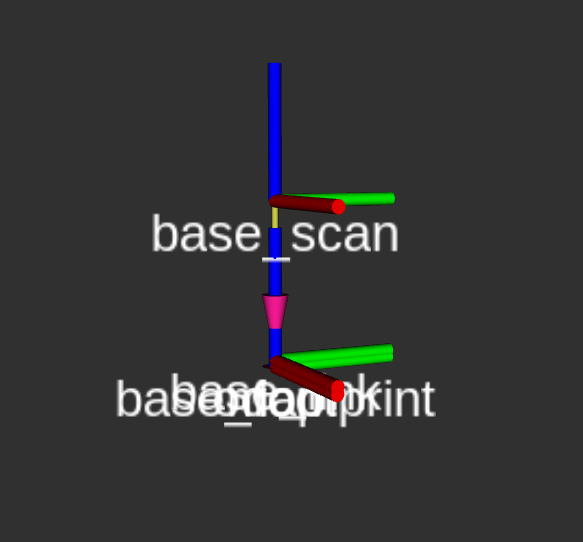
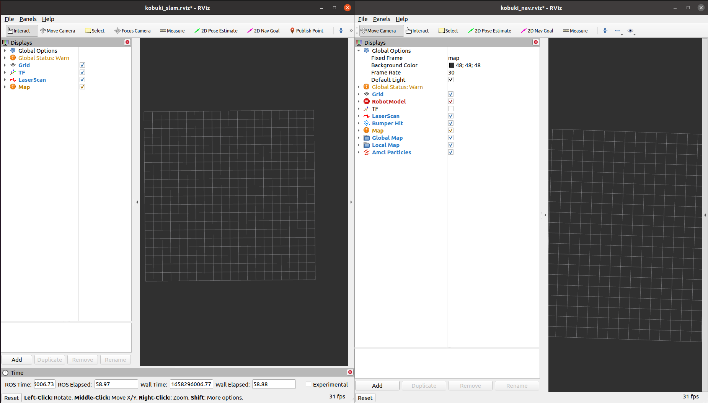

# Purpose
- kobuki, RPlidar 를 이용하여 SLAM navigation 을 통해 DWA 알고리즘을 이용하여 목적지까지 이동할 때 동적물체 발생 시 대처 반응 확인 실험 


# 작동관련
- $ roslaunch kobuki_node minimal.launch
- $ roslaunch kobuki_keyop safe_keyop.launch
1. kobuki_noetic.sh install
- $ bash kobuki_noetic.sh

2. connect
- RPlidar usb를 먼저 꼽고 , kobuki
- 설정해서 사용해도 됨!
- $ ls -l /dev | grep ttyUSB # 잘 잡히나 확인해보기
- $ sudo chmod 666 /dev/ttyUSB0 # RPlidar 권한 주기

```
아래의 rules를 이용하여 rplidar 장치의 permittion 설정

   KERNEL=="ttyUSB*", MODE="0666"


이 과정을 빠트리면, /dev/ttyUSB0 장치를 사용하는 node 구동 시 permittion 에러로 인해 node가 실행되지 않는다. 임시 방편으로 sudo chmod 666 /dev/dev/ttyUSB0 를 실행하면 되지만, 해당 USB 장치를 분리 후 재연결 하거나, 콘솔창을 다시 열거나, 시스템이 리부팅 될 때마다 다시 실행 해주어야 하므로, 아래 처럼 udev.rules를 수정한다. 


'/etc/udev/rules.d/70-persistent-net.rules' 파일을 열어 아래 표시된 부분을 추가한다.

 $ sudo nano /etc/udev/rules.d/70-persistent-net.rules


  GNU nano 2.2.6           File: /etc/init.d/ttyAMA0.conf             Modified

​# This file was automatically generated by the /lib/udev/write_net_rules
# program, run by the persistent-net-generator.rules rules file.
#
# You can modify it, as long as you keep each rule on a single
# line, and change only the value of the NAME= key.

# USB device 0x:0x (smsc95xx)
SUBSYSTEM=="net", ACTION=="add", DRIVERS=="?*", ATTR{address}=="b8:27:eb:14:a2:$

# USB device 0x:0x (rtl8192cu)
SUBSYSTEM=="net", ACTION=="add", DRIVERS=="?*", ATTR{address}=="00:a8:2b:00:04:$ 

# USB device for rplidar

KERNEL=="ttyUSB*", MODE="0666" 


^G Get Help  ^O WriteOut  ^R Read File ^Y Prev Page ^K Cut Text  ^C Cur Pos
^X Exit      ^J Justify   ^W Where Is  ^V Next Page ^U UnCut Text^T To Spell 

 

udev 는 시스템에 연결된 장치의 노드를 그 연결순서와 상관없이 연결될 때마다 동적으로 제공하는 일종의 장치관리자로서, 장치가 연결 될 때 장치명과, 권한 등을 정해준다. 이 때 그 규칙이 기재된 파일을 참조하게 되는데, 우분투의 경우 '/etc/udev/rules.d/70-persistent-net.rules'파일이 바로 그 파일이다.
```
### 변경해야할 부분
1. Lidar sensor change
-[oroca](https://cafe.naver.com/openrt/6258)
- 위를 따라갈 예정이다 하지만 나는 RPlidar A2를 사용할 것이기 떄문애 변경해 주어야한다.
- "kobuki_slam.launch" 파일에 urg node를 제와하고 RPlidar 부분을 넣을 것이다.
- "kobuki_navigation.launch" file 역시 동일하게 센서 부분을 변경해 준다.
```xml
<launch>
  <!--node pkg="urg_node" type="urg_node" name="kobuki_urg_node" output="screen">
    <param name="frame_id" value="base_scan" />
  </node-->
  <!-- LIDAR -->
  <node name="rplidarNode"          pkg="rplidar_ros"  type="rplidarNode" output="screen">
        <param name="serial_port"         type="string" value="/dev/ttyUSB0"/>
        <param name="serial_baudrate"     type="int"    value="115200"/><!--A1/A2 -->
        <!--param name="serial_baudrate"     type="int"    value="256000"--><!--A3 -->
        <param name="frame_id"            type="string" value="base_scan"/>
        <param name="inverted"            type="bool"   value="false"/>
        <param name="angle_compensate"    type="bool"   value="true"/>
  </node>
```

2. Noetic 마이그레이션 가이드에 따르면
- navgiation file에 xacro를 불러 올때 ".py"를 지우고 xacro.py 가아닌 xacro 로 
```xml
<launch>

  <!-- kobuki model -->
  <arg name="urdf_file" default="$(find xacro)/xacro '$(find kobuki_description)/urdf/kobuki_standalone.urdf.xacro'" />
  <param name="robot_description" command="$(arg urdf_file)" />
```


### RPlidar, kobuki slam  
```
roslaunch kobuki_node minimal.launch # turn on robot
roslaunch kobuki_slam kobuki_slam.launch
rosrun rviz rviz -d `rospack find kobuki_slam`/rviz/kobuki_slam.rviz #rviz 실행
roslaunch kobuki_keyop safe_keyop.launch # robot 조종
rosrun map_server map_saver # map 저장


```

## ETC
1. Sensor 구동
- $ roslaunch rplidar_ros rplidar.launch

2.tf 를 확인 해보자
```cpp
// tf 차이가 있을 줄 알았는데 원본 git과 동일했다. 나는 2번째 칸에 RPLiDAR 를 설치해서 그런 것일 수도 있다
#include <ros/ros.h>
#include <tf/transform_broadcaster.h>

int main(int argc, char** argv){
  ros::init(argc, argv, "kobuki_tf");
  ros::NodeHandle n;

  ros::Rate r(100);

  tf::TransformBroadcaster broadcaster;

  while(n.ok()){
    broadcaster.sendTransform(
      tf::StampedTransform(
        tf::Transform(
          tf::Quaternion(0, 0, 0, 1),
          tf::Vector3(0.0, 0.0, 0.01)),
          ros::Time::now(),
          "base_footprint",
          "base_link"));

    broadcaster.sendTransform(
      tf::StampedTransform(
        tf::Transform(
          tf::Quaternion(0, 0, 0, 1),
          tf::Vector3(0.0, 0.0, 0.24)),
          ros::Time::now(),
          "base_link",
          "base_scan"));

    r.sleep();
  }
}
```



3. rviz를 띄우고 골을 주면서 왜 안되냐! 라는 생각을 했었는데 
- nav rviz를 안 띄우고 slam rviz를 띄웠었다,,,,, 왼(slam), 오(nav)



## [Reference]
- [wiki](http://wiki.ros.org/kobuki/Tutorials/Examine%20Kobuki)
- [turtlebot2 RPlidarA2](https://surfertas.github.io/ros/2020/07/11/turtlebot2-lidar.html)
- [Justin](https://soohwan-justin.tistory.com/)
- [Lidar 측정원리](https://en.wikipedia.org/wiki/LIDAR)
